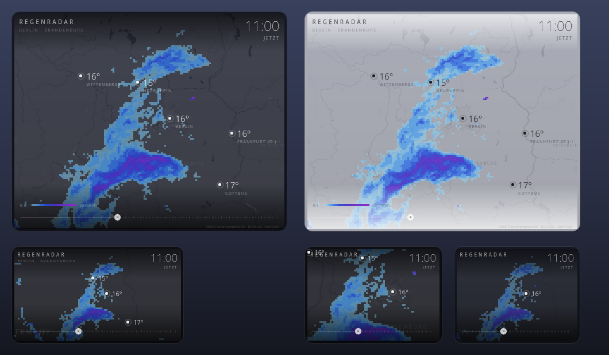

# Regenradar — Plasma 6 Desktop-Widget

*A minimalist, half-transparent rain-radar widget for KDE Plasma 6, showing DWD
radar and nowcast for Berlin and Brandenburg. Documentation below is in German.*

Ein minimalistisches, halbtransparentes Niederschlagsradar für **Berlin und
Brandenburg**. Schwarz-weiße Karte, Regen in Hellblau → Violett, Temperaturen an
einigen Orten, und ein einziger Regler: die Zeit.



## Was es anzeigt

| Zeitraum | Quelle | Auflösung |
|---|---|---|
| −2 h … jetzt | DWD-Radarkomposit **RV** (Analyse) | 1 × 1 km, 10-Minuten-Schritte |
| jetzt … +2 h | DWD-Radarkomposit **RV** (Radar-Nowcast) | 1 × 1 km, 10-Minuten-Schritte |
| +2 h … +N h | DWD **ICON-D2** über Open-Meteo | 2,2 km, 15-Minuten-Schritte |
| Temperaturen | Open-Meteo (`temperature_2m`, 15-min-Reihe) | 8 Orte, folgt dem Zeitregler |
| Karte | Esri „World Dark/Light Gray Canvas“ | Kachel-Layer |

Alle Quellen sind frei und brauchen keinen API-Schlüssel.

Die DWD-Kacheln kommen in 15 festen Klassen auf DWD-Grün/Gelb/Rot. Das Widget
liest die Klassen pixelweise aus und zeichnet sie in der eigenen Blau-Violett-
Skala neu — Radar und Modell-Vorhersage nutzen dieselben Klassengrenzen und
dieselbe Legende.

## Bedienung

| Aktion | Wirkung |
|---|---|
| Regler ziehen | Zeit vor- und zurückspulen |
| Mausrad über dem Widget | ein Zeitschritt vor/zurück |
| Doppelklick | zurück auf „JETZT“ |
| **Ziehen auf der Karte** | Kartenausschnitt verschieben |
| **Strg + Mausrad** | zoomen (auf den Mauszeiger) |
| Rechtsklick → *Regenradar einrichten…* | Einstellungen |
| Hover → Griff | verschieben und Größe ändern |

Zoom und Ausschnitt werden gespeichert. *Ansicht zentrieren* in den
Einstellungen setzt beides zurück.

Der durchgezogene Teil des Reglers ist Vergangenheit, der gepunktete Zukunft;
der hellere Strich markiert „jetzt“. Zukunftsbilder sind oben rechts als
`PROGNOSE` (Radar-Nowcast) bzw. `MODELL` (ICON-D2) gekennzeichnet.

## Einstellungen

* **Transparenz** — 20 % … 100 %
* **Zoom** — 0,5 × … 5,0 × (1 × zeigt genau Berlin + Brandenburg), plus
  *Ansicht zentrieren*
* **Eckenradius**
* **Vorhersage** — 1 bis 8 Stunden Horizont
* **Anzeigen** — Temperaturen, Farbskala
* **Karte** — helle Variante

## Installation

```bash
./install.sh          # installiert bzw. aktualisiert und startet die Shell neu
```

Danach: Rechtsklick auf den Desktop → *Widgets hinzufügen…* → **Regenradar**.

Deinstallieren:

```bash
./uninstall.sh
```

## Entwicklung

`package/` ist das Plasmoid. Es lässt sich ohne Plasma testen: `RadarView.qml`
hat bewusst keine Plasma-Abhängigkeiten, `main.qml` reicht nur die
Konfiguration durch.

```bash
python3 test/preview.py --qml test/Sizes.qml --out /tmp/preview.png --delay 20000
```

rendert offscreen (PySide6) in eine PNG-Datei, ohne die laufende Sitzung
anzufassen. `test/Frames.qml` zeigt Vergangenheit, Jetzt, Nowcast und
Modell-Vorhersage nebeneinander. `RadarView` hat ausserdem `debugOverlay: true`.

### Fallstricke, die hier eingebaut sind

* **RainViewer** wird nicht benutzt: der freie Kachel-Endpunkt liefert oberhalb
  von Zoom 7 nur „Zoom Level Not Supported“, und der `color`-Parameter wird
  ignoriert — alle Schemata liefern byte-identische Kacheln.
* **`sld_body`** am DWD-GeoServer ist gesperrt („Dynamic style usage is
  forbidden“), Umfärben muss also clientseitig passieren.
* **`putImageData` ist wirkungslos** (Qt Quick Canvas, zumindest im
  Software-Backend) — `getImageData` funktioniert. Deshalb wird das Feld als
  lauflängenkodierte `fillRect`-Spannen gezeichnet.
* **`renderStrategy: Canvas.Immediate`** ist Pflicht; mit der Standard-Strategie
  wird der Paint still verworfen. Kosten: ~9 ms pro Bild bei 710 × 510.
* **Shader-Effekte** (`MultiEffect`) werden bewusst nirgends verwendet, damit das
  Widget auch ohne GPU-Pfad identisch aussieht. Runde Ecken entstehen dadurch,
  dass die Karte so weit eingerückt ist, dass ihre Ecken innerhalb der
  abgerundeten Karte bleiben.

## Datenquellen / Attribution

* Radar: Deutscher Wetterdienst, Radarkomposit RV, `maps.dwd.de/geoserver`
* Modell: DWD ICON-D2 über [Open-Meteo](https://open-meteo.com)
* Karte: Esri, HERE, Garmin, © OpenStreetMap-Mitwirkende
